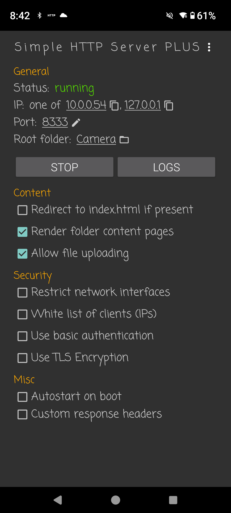
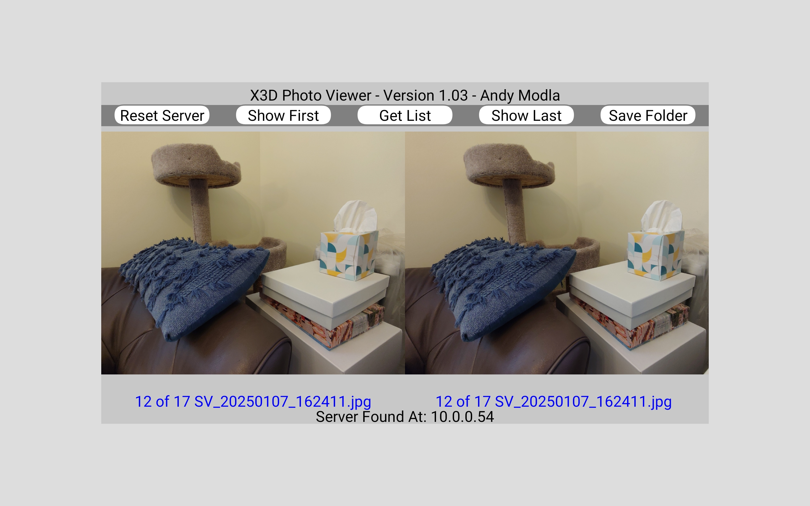

# X3D-Photo
XReal Beam Pro 3D Camera Photo View and Transfer Android app

This app is written as a Processing Java Android sketch app. It runs on a client 3D display device like the Leia LumePad 2, and is not intended to run on the Xreal Beam Pro serving device because the camera app runs here. 
It views and transfers photos over WiFi from the XReal Beam Pro camera folder using the Google Play Store "Simple HTTP Server Plus" app as a photo server.
Transfered photos have the jpg photo filename changed to the suffix "_2x1.jpg" and it adjust the parallax of the SBS photos to a foreground stereo window using a fixed displacement.
The app automatically searches for the photo server on a local WiFi network where both devices should be connected. The HTTP server port is set to 8333.

The configuration of the Simple HTTP Server Plus app as it appears from its configuration screen:

The "Get List" menu button loads the photo file list from the HTTP Server.

The "Show First" and "Show Last" menu buttons load the first or last photo from the server file list.

Pressing left eye photo shows the previous photo in the list, and pressing the right eye photo shows the next photo in the list.

The app stores transferred photos to the default Pictures/X3D album. This can be changed by pressing the "Save Folder" menu button and select a new folder.

"Reset Server" menu button starts a search for a Simple HTTP Server Plus server on a different Beam Pro device. Only one can be connected to the network at a time or run only one server at a time.

I use the LeiaPlayer on the Lume Pad 2 to view the transferred files in 3D. The X3D Photo Viewer runs in the background.

